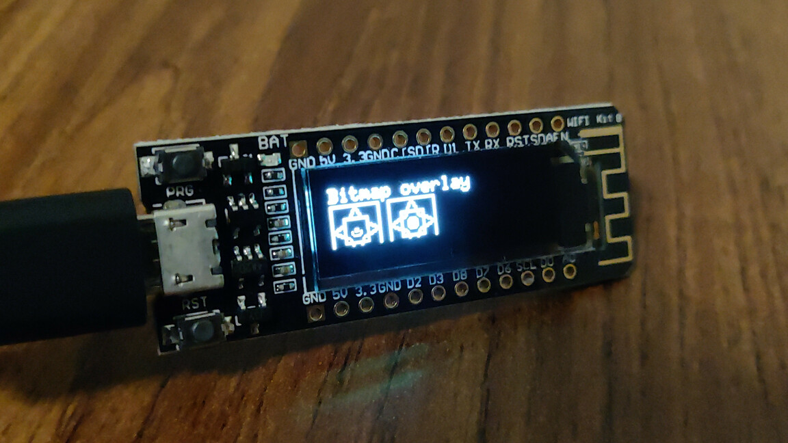

# dk-w8266-lua

Self-contained NodeMCU-firmware Lua example for Deek-Robot 0.91" kit ([here on AliExpress](https://www.aliexpress.com/item/4000295955001.html), prod to have your link added), a.k.a. Heltec Wifi Kit 8.




# Build requirements

[Build the firmware](https://nodemcu-build.com/) with (at least) these modules:

```
bit file gpio i2c node tmr u8g2 uart wifi
```

Also ensure you choose `ssd1306_i2c_128x32_univision` as the I²C display in the build UI's dropdown (for this example, it is irrelevant what you choose for the SPI dropdown, and the default font list of `font_6x10_tf,font_unifont_t_symbols` will suffice).

Flash said firmware using e.g. [esptool.py](https://github.com/themadinventor/esptool):

```
$ ./esptool.py --port /dev/ttyUSB0 write_flash -fm qio 0x00000  nodemcu-master-*-modules-*.bin
esptool.py v2.2
Connecting....
Detecting chip type... ESP8266
Chip is ESP8266EX
Uploading stub...
Running stub...
Stub running...
Configuring flash size...
Auto-detected Flash size: 4MB
Flash params set to 0x0040
Compressed 475136 bytes to 309820...
Wrote 475136 bytes (309820 compressed) at 0x00000000 in 27.3 seconds (effective 139.2 kbit/s)...
Hash of data verified.

Leaving...
Hard resetting...
```

# Usage

(Assuming [nodemcu-tool](https://www.npmjs.com/package/nodemcu-tool) is in `$PATH`.)

```
$ make upload restart console
nodemcu-tool upload init.lua
[NodeMCU-Tool]~ Connected 
[device]      ~ Arch: esp8266 | Version: 3.0.0 | ChipID: 0x4eafa6 | FlashID: 0x1640ef 
[NodeMCU-Tool]~ Uploading "init.lua" >> "init.lua"... 
[connector]   ~ Transfer-Mode: hex 
[NodeMCU-Tool]~ File Transfer complete! 
[NodeMCU-Tool]~ disconnecting 
nodemcu-tool reset
[device]      ~ Hard-Reset executed (100ms) 
[NodeMCU-Tool]~ disconnecting 
nodemcu-tool terminal
[terminal]    ~ Starting Terminal Mode - press ctrl+c to exit 
--- Starting Graphics Test ---
>
```


# Resources

[Useful resource](https://robotzero.one/heltec-wifi-kit-8/).

[Totally ripped off from graphics_test.lua](https://github.com/nodemcu/nodemcu-firmware/blob/master/lua_examples/u8g2/graphics_test.lua)

[Also useful](https://github.com/Heltec-Aaron-Lee/WiFi_Kit_series)
